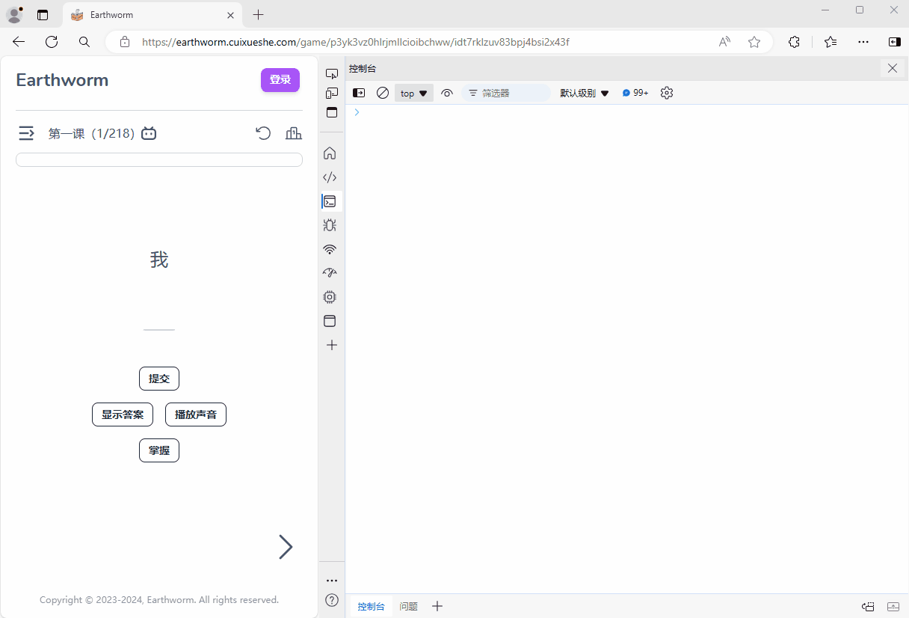

## 一个用于在 earthworm 网页的控制台中答题的油猴插件

插件会在 `window` 注入以下两个方法

### 1. `window.show()`
查看当前句子

### 1. `window.input(string)`
- `string`，句子答案

回答错误3次会在控制台输出正确的答案

回答正确后自动显示下一个句子

目前只有以上两个简单的功能，后续会逐渐完善（如果有空的话）